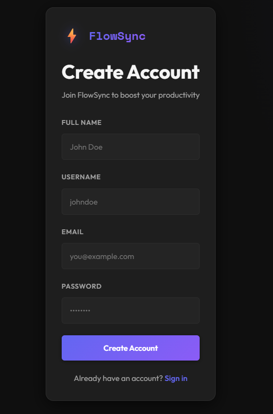
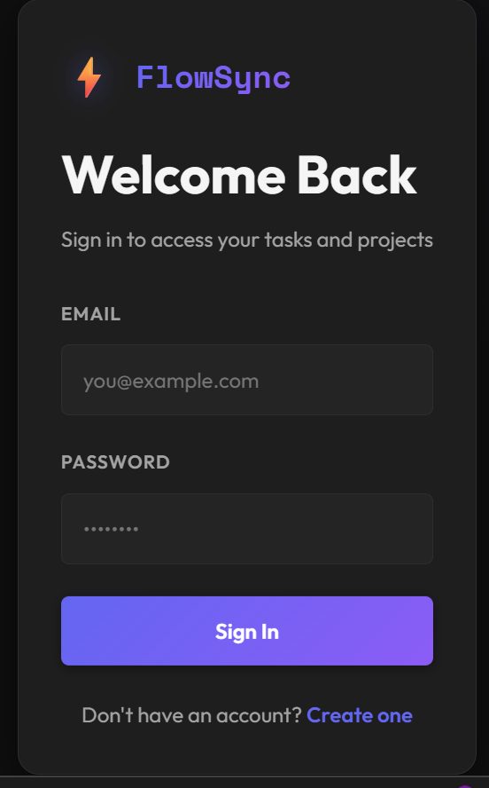
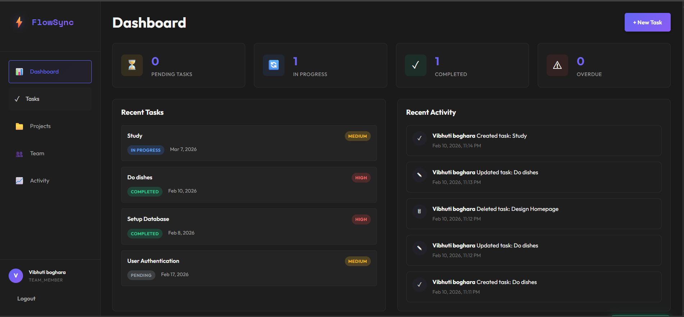
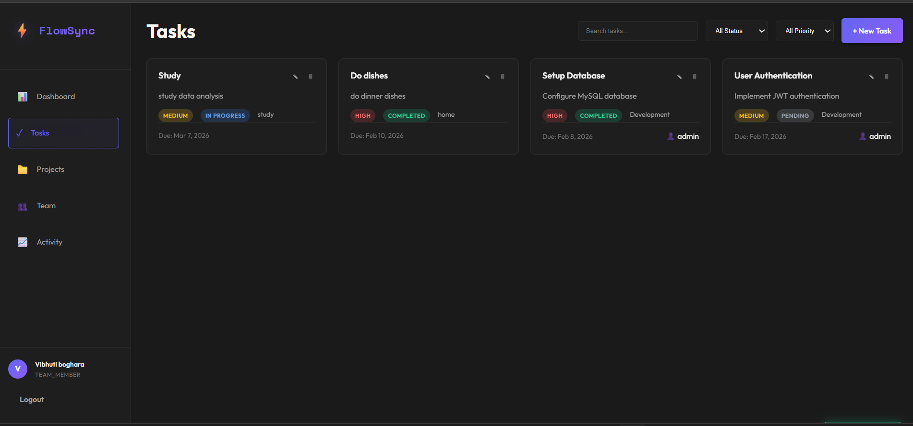
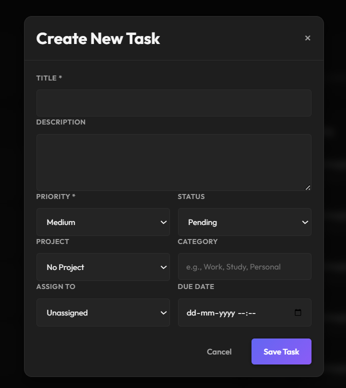
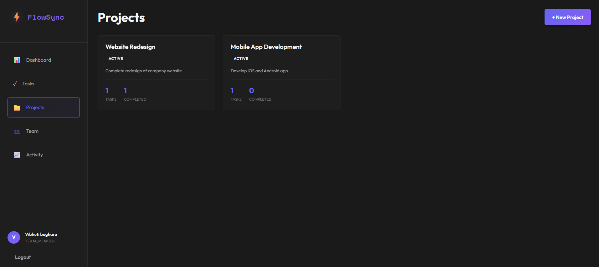
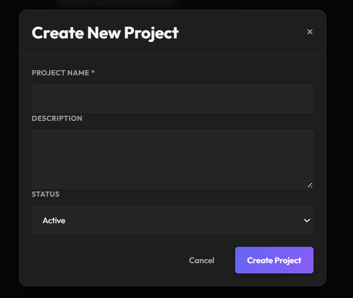
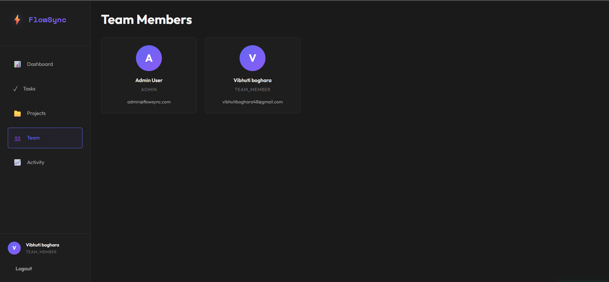
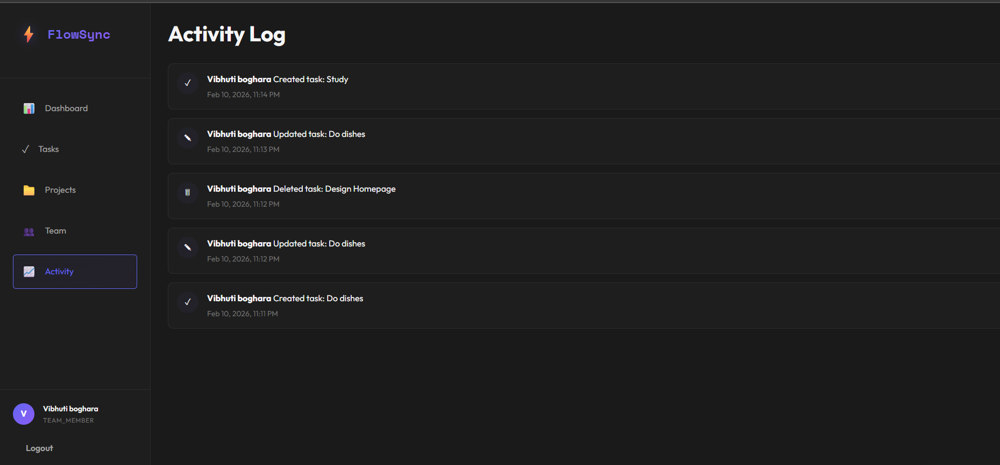

# 🎯 FlowSync – Smart Task & Productivity Hub

FlowSync is a **full-stack task and productivity management web application** developed as a **Final Year Graduation Project**.  
It helps individuals and teams manage tasks, projects, and daily work efficiently through a clean, modern, dark-themed interface.

The system supports authentication, task tracking, project organization, team collaboration, and activity logging.

---

## 🚀 Features

- User Login & Registration (JWT Authentication)
- Dashboard with task statistics
- Create, update, delete tasks
- Task priority & status management
- Project creation & tracking
- Team member management
- Activity log (tracks all user actions)
- Modern dark UI for better usability

---

## 🛠 Tech Stack

- **Frontend:** HTML, CSS, JavaScript  
- **Backend:** Node.js, Express.js  
- **Database:** MySQL  
- **Authentication:** JWT  
- **Tools:** Git, GitHub, VS Code  

---

## 📸 Screenshots

### 1️⃣ Registration & Login
| Register | Login |
|---------|-------|
|  |  |

---
### 2️⃣ Dashboard
<p align="center">
  
</p>

---

### 3️⃣ Tasks & Create Task

| Tasks Page | Create Task Modal |
|------------|------------------|
|  |  |


---

### 4️⃣ Projects & Create Project
<p align="center">
  
</p>

<p align="center">
  
</p>

---

### 5️⃣ Team & Activity Log
<p align="center">
  
  
</p>

---


## ⚙️ Setup Instructions

```bash
git clone https://github.com/your-username/FlowSync.git
cd FlowSync/backend
npm install
npm run dev
````

Import database:

```bash
mysql -u root -p flowsync_db < database/schema.sql
```

Open `frontend/index.html` using **Live Server**.

---
## ▶️ How to Run the Project Locally

Follow the steps below to run **FlowSync** on your local system.

---

### 🧩 Prerequisites

Make sure you have the following installed:

- **Node.js** (v18+ recommended)
- **MySQL** (v8+)
- **Git**
- Any modern browser (Chrome / Edge)

---

### 🗄️ Database Setup

1. Open MySQL and create a database:
   ```sql
   CREATE DATABASE flowsync_db;
⚙️ Backend Setup

Navigate to the backend folder:

cd backend


Install dependencies:

npm install


Create a .env file inside the backend folder and add:

PORT=3000
NODE_ENV=development

DB_HOST=localhost
DB_USER=root
DB_PASSWORD=your_mysql_password
DB_NAME=flowsync_db
DB_PORT=3306

JWT_SECRET=your_super_secret_key
JWT_EXPIRES_IN=7d

FRONTEND_URL=http://localhost:5500


Start the backend server:

npm run dev


✅ You should see:

FlowSync API Server Running
Database connected successfully

🌐 Frontend Setup

Open the frontend folder

Open index.html using:

Live Server (VS Code extension) OR

Directly open in browser

The frontend will run on:

http://localhost:5500

🔐 Sample Login (Optional)

If sample data is inserted:

Email: admin@flowsync.com

Password: admin123

🧪 Features to Test

User registration & login

Create / update / delete tasks

Project management

Team members view

Activity logging

Dashboard statistics

📝 Notes

This project was developed as a Final Year Graduation Project

Backend and frontend are separated for clean architecture

Screenshots in the README show actual working features

---
## 🌙 UI Note

FlowSync is designed with a **dark-mode focused UI** for a modern and comfortable user experience.
Future improvements include advanced analytics and role-based access control.

---

## 👩‍💻 Developed By

**Ishita Boghara**
Final Year Graduation Project
(Currently FYMCA Student)

---

⭐ If you like this project, feel free to star the repository!

```
